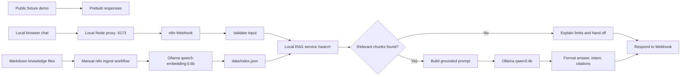

# Architecture

## Responsibilities

- n8n owns orchestration, input validation, branching, model calls, response formatting, and human-handoff decisions.
- `services/rag-service` owns Markdown parsing, chunking, embeddings, cosine retrieval, and source metadata.
- Ollama owns local generation and embedding inference.
- `demo/` is a safe, offline portfolio surface backed by fixtures rather than a live webhook.
- `local-chat/` and `services/chat-ui/` provide the real local browser path; the proxy is loopback-only and forwards requests to n8n.

## Trust boundaries

The real webhook, RAG service, and Ollama endpoint are local-only by default. The public static demo never sends user messages to the local machine. All included support data is fictional.
